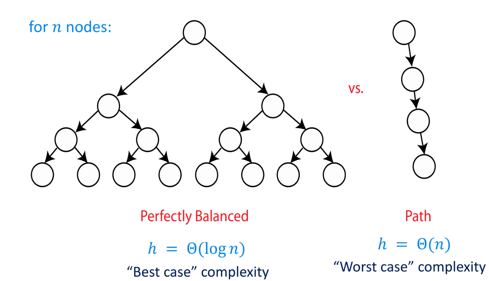
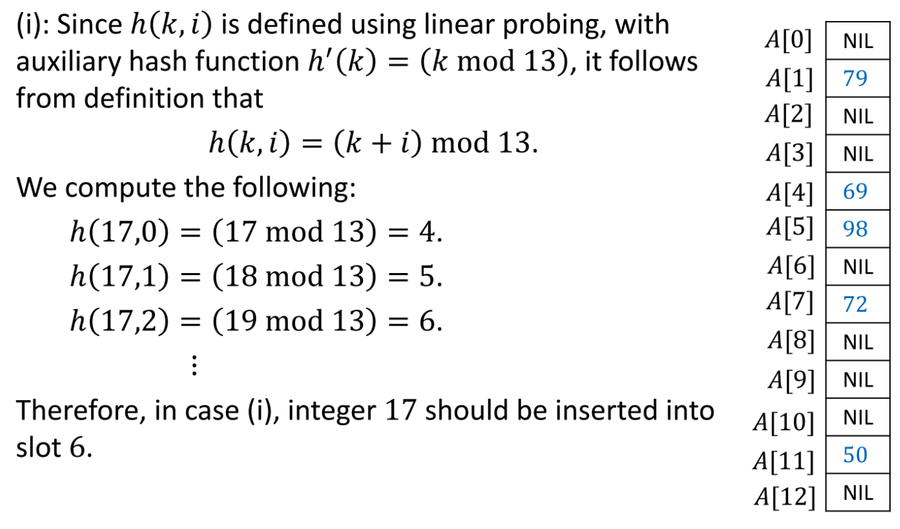
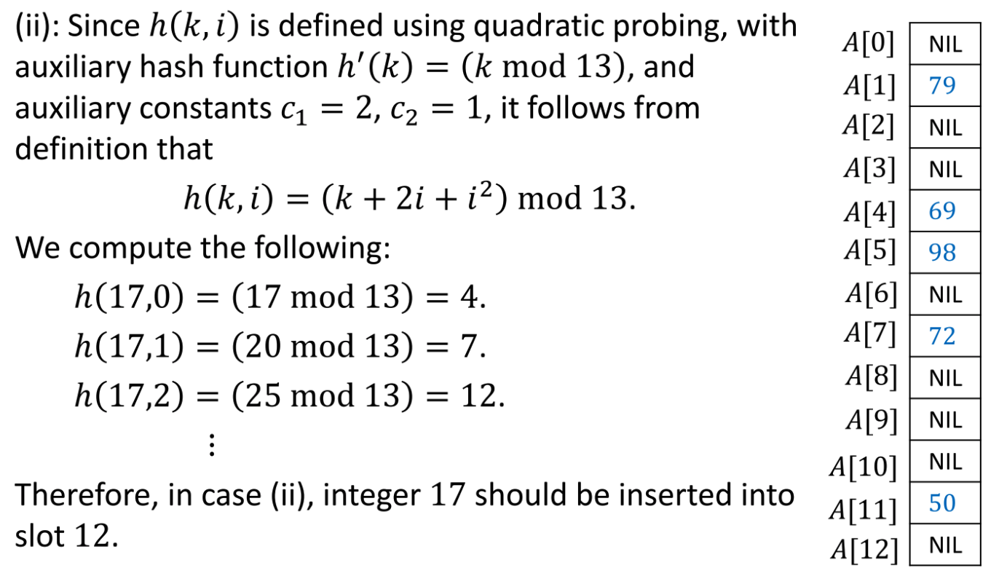
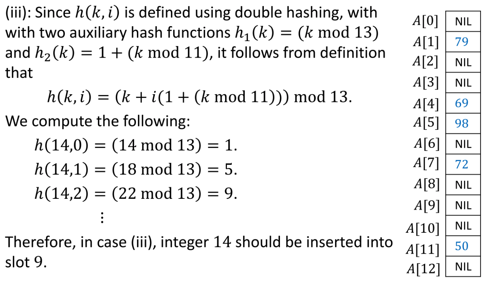
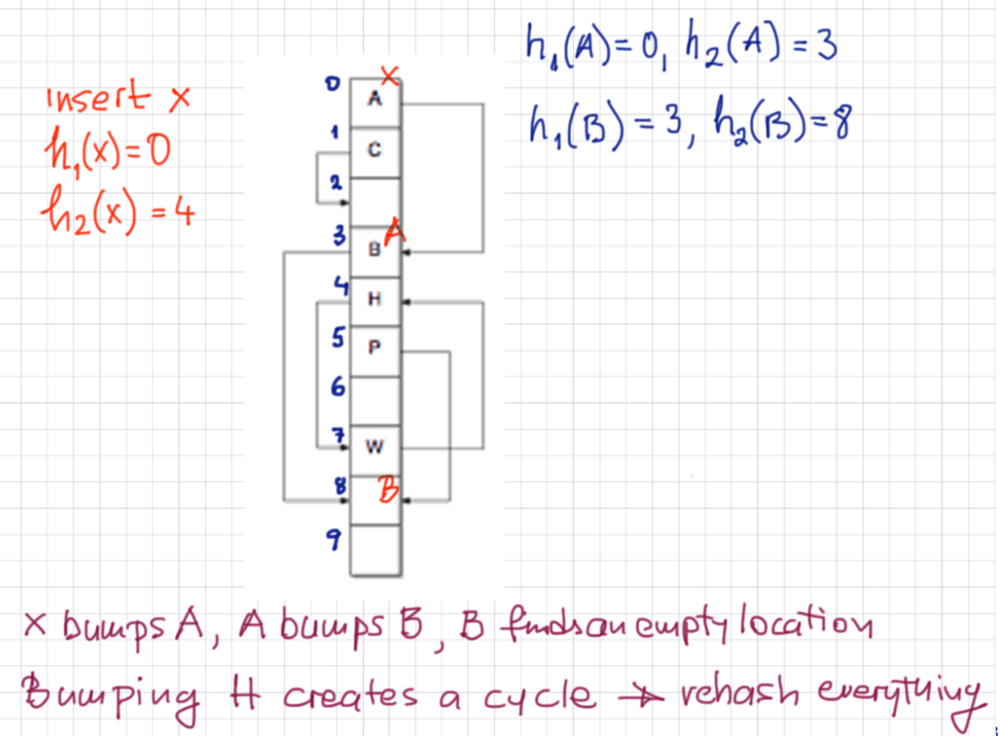

# Algorithm Notes  

1) Complexity, Asymptotic Notation and Document Distance
2) Sorting and Master Theorem
3) Heap Sort
4) Binary Search Tree (BST), AVL Tree, Linear Time Sorting
5) Hashing
6) Graph, BFS
7) Djikstra's Algorithmn Single Shortest Path
8) Bellman-Ford Algorithm
9) Dynamic Programming
10) P & NP

### 1) Complexity, Asymptotic Notation and Document Distance
a) Θ Notation: The theta notation bounds a functions from above and below, so it defines exact asymptotic behavior.  
Drop lower order terms and ignore leading constants eg.T(50n<sup>3</sup> + 30n<sup>2</sup>) = Θ(n<sup>3</sup>)

b) Big O Notation: The Big O notation defines an upper bound of an algorithm, it bounds a function only from above.  
For example, consider the case of Insertion Sort. It takes linear time in best case and quadratic time in worst case. We can safely say that the time complexity of Insertion sort is O(n<sup>2</sup>). Note that O(n<sup>2</sup>) also covers linear time.

c) Ω Notation: Just as Big O notation provides an asymptotic upper bound on a function, Ω notation provides an asymptotic lower bound. (least used notation amongst all 3 since the best case time is usually not useful)

In order of growth  
lg(n), sqrt(n), n, nlg(n), n<sup>2</sup>, n<sup>3</sup>, 2<sup>n</sup>, n!, n<sup>n</sup>  


#### Document Distance

"the cat" vs "the dog"  
[the cat].[the dog]=the the + cat dog  
formula: (D<sub>1</sub>.D<sub>2</sub>)/(||D<sub>1</sub>||.||D<sub>2</sub>||)  
eg. ["the cat"."the dog"]/sqrt(2x2)= [the x the + cat x dog] /2  
				   = [1+0]/2
				   = 50%


### 2) Sorting and Master Theorem

#### Merge Sort

#### Heap Sort

#### Master Theorem
Given a recursive algorithm, use master theorem to determine its algorithmic complexity

T(n) = aT(n/b) + f(n)

a) If f(n) = O(n<sup>log<sub>b</sub>a.c</sup>), for some constant c>0, then T(n)= Θ(n<sup>log<sub>b</sub>a</sup>)  
b) If f(n) = Θ(n<sup>log<sub>b</sub>a</sup>), then T(n)=Θ(n<sup>log<sub>b</sub>a</sup>lg(n))
c) If f(n) = Ω(n<sup>log<sub>b</sub>a+c</sup>) , for some constant c>0, and if af(n/b)<=hf(n) for some constant h<1 and all sufficiently large n, then T(n) = Θ(f(n))

### 3) Heap
Data structure format to store and organize data to facilitate access and modification (can be visualized as a binary tree)  
Efficient data structure for implementing a kind of abstract data type (ADT) called priority queue (consists of a set S of elements, every element S has an associated key)

Operations:  
max(S): return element from S with the largest key  
insert(S,x): insert element x into S  
extract_max(S): return element from S with largest key and remove it from S  
increase_key(S, x, k): increase the value of the key of element x to the new value k

Types of heaps:  
Min-heap: the value of each node is greater than or equal to the value of its parent, with the minimum-value element at the root  
Max-heap: the value of each node is less than or equal to the value of its parent, with the maximum-value element at the root 

Depth of a node: Number of edges in the downward path from root to node x
Height of a node: Maximum possible number of edges in the downward path from the node x to a leaf (height of a leaf is 0)

Root of a tree has index 0  
For node index i;  
parent(i) = floor(1/2)  
left(i) = 2i  
right(i) = 2i+1

Operations on Heaps:  

|Operation|Description|Complexity|
|---------|-----------|----------|
|build_max_heap| Build a max heap from an unordered inout array| O(n) |
|max_heapify| Correct a single violation of the max heap property occuring at the root of an input subtree| O(logn)|
|insert|Insert element into array; array must remain as max heap|O(logn)|
|extract_max|Return element with the largest key and remove from array; array must remain as as max heap|O(logn)|
|heapsort|Sort an array of length n using a heap|O(nlogn)|

where A=array, i=index

```
MAX-HEAPIFY(A,i)
  l = LEFT(i)
  r = RIGHT(i)
  if l <= A.heapsize and A[l] > A[i]
     largest = l
  else
     largest = i
  if r <= A.heapsize and A[r] > A[largest]
     largest = r
  if largest != i
    exchange A[i] with A[largest]
    MAX-HEAPIFY(A,largest)
```
```
BUILD-MAX-HEAP(A)
  A.heapsize = A.length
  for i = A.length/2 downto 1
     MAX-HEAPIFY(A,i)
```
```
HEAPSORT(A)
  BUILD-MAX-HEAP(A)
  for i = A.length downto 2
     exchange A[1] with A[i]
     A.heapsize = A.heapsize - 1
     MAX-HEAPIFY(A,1)

```

### 4) Binary Search Tree, AVL Tree, Linear Time Sorting
Trees can be traversed in different ways  


-Inorder 
Gives nodes in a non-decreasing order (4 2 5 1 3)
```
1. Traverse the left subtree, i.e., call Inorder(left-subtree)
2. Visit the root.
3. Traverse the right subtree, i.e., call Inorder(right-subtree)
```

-Preorder  
Used to create a copy of the tree (1 2 4 5 3)
```
 1. Visit the root.
 2. Traverse the left subtree, i.e., call Preorder(left-subtree)
 3. Traverse the right subtree, i.e., call Preorder(right-subtree) 
```

-Postorder
Used to delete the tree (4 5 2 3 1)
```
1. Traverse the left subtree, i.e., call Postorder(left-subtree)
2. Traverse the right subtree, i.e., call Postorder(right-subtree)
3. Visit the root.
```

#### Binary Search Tree (BST)
Node-based binary search tree with properties:  
- Contains attributes left, right and p (parent)
- The left subtree of a node contains only nodes with keys lesser than the node’s key
- The right subtree of a node contains only nodes with keys greater than the node’s key

In a BST, data can be stored as an array or linked list  
Every node in a BST must hvae 4 attributes: x.left, x.right, x.parent, x.key

Some operations on BST

|Operation|Description|Time Complexity|
|---------|-----------|---------------|
|tree_insert|Insert element into BST; tree must remain as a BST|O(h), worst case O(n), tree is in a row|
|tree_delete|Delete element from BST|O(height of T)|
|tree_max|Given element x, return element with largest key value in subtree rooted at x|O(Height of x)|
|tree_min|Given element x, return element with smallest key value in subtree rooted at x|O(Height of x)|
|tree_search|Given element x and a value k, return first instance of an element with key value k in the subtree rooted at x, if it exists, otherwise return NIL|O(h), same as a tree_insert|
|succesor|Given element x, return the element in the BST wrt the in-order|O(depth of x)|
|predecessor|Given element x, return the previous element in the BST wrt the in-order|O(depth of x)|

```
tree_search
while x!=NIL and k!=x.key:
	if k<x.key then:
		x<-x.left
	else:
		x<-x.right
	return x
```

```
tree_max(x)
while x.right!=NIL:
	x<-x.right
return x
```

```
tree_min(x)
while x.left!=NIL:
	x<-x.left
return x
```

```
tree_insert(T,x)
y<-element in T thats available to be the parent of x
(y<-NIL;z<-T.root
while z!=NIL:
	y<-z
	if x.key<z.key, then:
	z<-z.left
else:
	z<-z.right)
x.parent<-y
if T.root=NIL, then:
	T.root=NIL, then:
		T.root<-x
	else if x.key<y.key, then:
		y.left<-x
	else:
		y.right<-x
```

```
tree_delete
1) Node to be deleted is leaf: Simply remove from the tree.

              50                            50
           /     \         delete(20)      /   \
          30      70       --------->    30     70 
         /  \    /  \                     \    /  \ 
       20   40  60   80                   40  60   80
2) Node to be deleted has only one child: Copy the child to the node and delete the child

              50                            50
           /     \         delete(30)      /   \
          30      70       --------->    40     70 
            \    /  \                          /  \ 
            40  60   80                       60   80
3) Node to be deleted has two children: Find inorder successor of the node. Copy contents of the inorder successor to the node and delete the inorder successor. Note that inorder predecessor can also be used.
```

```
succesor(x)
if x.right!=NIL then:
	return tree_min(x.right)
y<-x.parent
while y!=NIL and x=y.right:
	x<-y
	y<-y.parent
return y
```

#### AVL Tree
AVL tree is a self-balancing Binary Search Tree (BST) where the difference between heights of left and right subtrees cannot be more than one for all nodes



Insertion Algorithm:
```
Let the newly inserted node be w
1) Perform standard BST insert for w.
2) Starting from w, travel up and find the first unbalanced node. Let z be the first unbalanced node, y be the child of z that comes on the path from w to z and x be the grandchild of z that comes on the path from w to z.
3) Re-balance the tree by performing appropriate rotations on the subtree rooted with z. There can be 4 possible cases that needs to be handled as x, y and z can be arranged in 4 ways. Following are the possible 4 arrangements:
a) y is left child of z and x is left child of y (Left Left Case)
b) y is left child of z and x is right child of y (Left Right Case)
c) y is right child of z and x is right child of y (Right Right Case)
d) y is right child of z and x is left child of y (Right Left Case)
```

Balance_factor
```
1) Perform the normal BST insertion.
2) The current node must be one of the ancestors of the newly inserted node. Update the height of the current node.
3) Get the balance factor (left subtree height – right subtree height) of the current node.
4) If balance factor is greater than 1, then the current node is unbalanced and we are either in Left Left case or left Right case. To check whether it is left left case or not, compare the newly inserted key with the key in left subtree root.
5) If balance factor is less than -1, then the current node is unbalanced and we are either in Right Right case or Right-Left case. To check whether it is Right Right case or not, compare the newly inserted key with the key in right subtree root.
```

### 5) Hashing
Hash Function maps a big number or string to a small integer that can be used as index in hash table (fixed set of integers) -Best case scenario is where key values are distributed equally over all slots
(Direct Addressing, as in arrays with distinct integer key values VS Hashing, objects have arbitrary key values)

|Hash Function|Method|Example|
|-------------|------|-------|
|Division Method|Define h by the map h(k)=(k mod m)|K={0,1,2,...99999};m=10...h(k)=last digit of k; h(42493=3,h(93811)=1|
|Multiplication method|Define h by the map h(k)=floor(m(kB mod 1)), where 0<B<1 is a constant . (kB mod 1) denotes the fractional part of the number that comes after the decimal point|K = [0,100] (interval);m=10;B=sqrt(2)...h(2) = floor(10.(2.82842...mod1))=floor(10(0.82842...))=8|
|Non-Numerical Key Values|ASCII 128 characters encoded in 7 bit integers (Other encoded languages available, as long as it can be converted into numbers, same principle)|ABC interpreted as 1073475, given hash value 734(3rd to 5th digits from the right|


Hash table: Similar to a direct address table, but each object is stored based on its hash value (value after pasing the key value to the hash function.  
-a=n/m is the load factor of a hash table A (we want to minimize complexity and hence for a=O(1) --> n=O(m) ie need to increase n and m together (n is the number of elements in A, m is the number of slots in A)  
-Suppose we want to keep n<=cm for some constant c, we can do so by ensuring that the load factor a never exceeds c (Whenever the load factor a would exceed c with the insertion of just one more element, we re-hash to increase the number of slots (ie increase m) so that (new n)<=c(new m)  
-If a <=c, continue inserting element as per normal; if a>c, re-hash with (usually) 2m slots
-Why double? If constant increment, total no. of steps taken to insert n elements: Ω(n<sup>2</sup>); if doubling then total no. of steps: O(n)

|Operation|Description|Time Complexity|Pseudocode|
|---------|-----------|---------------|----------|
|chain_hash_insert(A,x)|Insert x at the head of the linked list in the slot h(x.key) of A|O(1)|list_insert(A[h(x.key)],x)|
|chain_hash_delete(A,x)|Delete x from the linked list in slot h(x.key) of A|O(1)|list_delete(A[h(x.key)],x)|
|chain_hash_search(A,k)|Return element(pointer) of A whose key value is k|O(n)|list_search(A[h(k)],k)|
|chain_hash_delete_key(A,k)|Delete element(pointer) of A whose key value is k|O(n)|list_delete_key(A[h(k)],k)|

Collision Handling/Resolution: Since a hash function gets us a small number for a big key, there is possibility that two keys result in same value. The situation where a newly inserted key maps to an already occupied slot in hash table is called collision and must be handled using some collision handling technique. Following are the ways to handle collisions:  

Chaining: The idea is to make each cell of hash table point to a linked list of records that have same hash function value. Chaining is simple, but requires additional memory outside the table.  

Open Addressing: In open addressing, all elements are stored in the hash table itself. Each table entry contains either a record or NIL. When searching for an element, we examine table slots one by one until the desired element is found or it is clear that the element is not in the table.  
-Contrain every slot of A to have at most one element.  
-Whenever the insertion of new element x into A would cause a collision, find a different empty slot to insert x.   
-Open addressing refers to a systematic method for finding the next available empty slot to insert any element that would otherwise cause a collision. (Since every slot has <=1 element, the load factor of such a hash table cannot exceed 1)  
-The process of finding another available empty slot is called probing (generate a permutation probe sequence(i1...im) of (0...m-1). To insert a new element c, try to insert x into slot i...im one-by-one until insertion is successful (insert x based on the probe sequence associated to its k value  
-For open addressing, we require the hash function to give us a sequence of slot numbers h(k,0)...h(k,m-1) instead of a single value  

|Probe sequence method|Description|
|---------------------|-----------|
|Linear Probing|Start with an auxiliary function h':K-->{0,1,...,m'-1}, then define h(k,i) = (h'(k)+i)mod m  
|
|Quadratic Probing|Start with an auxiiliary hash function h':K-->{0,1,...,m'-1}, and 2 auxiliary constants c1,c2, then define  h(k,i)=(h'(k)+c1i+c2i<sup>2</sup>) mod m . 
|
|Double Hashing|Use 2 auxiliary hash functions h1: K-->{0,1,...,m1-1} and h2: K-->{0,1,...m2-1}, then define  h(k,i)=(h1(k)+ih2(k))mod m . 
|
|Cuckoo Hashing|Open addressing with 2 hash functions h1(k) and h2(k), both are not the same: and every value k gets hashed either to h1(k) or h2(k). Searching takes O(1) steps since only 2 slots have to be checked. If slot h1(k) is empty, store x in h1(k), else if slot h2(k) is empty, then store x in slot h2(k), else push out element y in h1(k), store x in h1(k) and store y in its only other possible slot it can occupy
|


### 6) Graph, BFS, DFS, topological sort
BFS vs DFS  

[bfsdfs]!(bfsdfs.png)

```
BFS Algorithm
BFS(s,Adj):
	level={s:0}
	parent={s:None}
	i=1
	frontier=[s]
	while frontier:
		next=[]
		for u in frontier
			for v in Adj[u]
				if v in Adj[u]
					if v not in level
						level[v]=1
						parent[v]=u
						next.append(v)
		frontier=next
		i+=1
```

```
DFS Algorithm:
parent = {s:None}
DFS-visit (V,Adj,s):
	for v in Adj[s]:
		if v not in parent:
			parent[v] = s
			DFS-visit(V,Adj,v)
```

Topological sort of DAG G=(V,E)  
1) Run DFS(G), compute finishing times of nodes  
2) Output the nodes in decreasing order of finishing times

Time complexity of both BFS and DFS will be O(V + E), where V is the number of vertices, and E is the number of Edges. This again depends on the data strucure that we user to represent the graph. If it is an adjacency matrix, it will be O(V^2). If we use an adjacency list, it will be O(V+E)

### 7) Dijkstra's Algorithm Single Shortest Path
Algorithm
1) Create a set sptSet (shortest path tree set) that keeps track of vertices included in shortest path tree, i.e., whose minimum distance from source is calculated and finalized. Initially, this set is empty.
2) Assign a distance value to all vertices in the input graph. Initialize all distance values as INFINITE. Assign distance value as 0 for the source vertex so that it is picked first.
3) While sptSet doesn’t include all vertices
….a) Pick a vertex u which is not there in sptSet and has minimum distance value.
….b) Include u to sptSet.
….c) Update distance value of all adjacent vertices of u. To update the distance values, iterate through all adjacent vertices. For every adjacent vertex v, if sum of distance value of u (from source) and weight of edge u-v, is less than the distance value of v, then update the distance value of v.

Time Complexity: O(V<sup>2</sup>)

Dijkstra doesn’t work for Graphs with negative weight edges (Have to use Bellman Ford's Algorithm)

```
# Python program for Dijkstra's single 
# source shortest path algorithm. The program is 
# for adjacency matrix representation of the graph 

# Library for INT_MAX 
import sys 

class Graph(): 

	def __init__(self, vertices): 
		self.V = vertices 
		self.graph = [[0 for column in range(vertices)] 
					for row in range(vertices)] 

	def printSolution(self, dist): 
		print "Vertex \tDistance from Source"
		for node in range(self.V): 
			print node, "\t", dist[node] 

	# A utility function to find the vertex with 
	# minimum distance value, from the set of vertices 
	# not yet included in shortest path tree 
	def minDistance(self, dist, sptSet): 

		# Initilaize minimum distance for next node 
		min = sys.maxint 

		# Search not nearest vertex not in the 
		# shortest path tree 
		for v in range(self.V): 
			if dist[v] < min and sptSet[v] == False: 
				min = dist[v] 
				min_index = v 

		return min_index 

	# Funtion that implements Dijkstra's single source 
	# shortest path algorithm for a graph represented 
	# using adjacency matrix representation 
	def dijkstra(self, src): 

		dist = [sys.maxint] * self.V 
		dist[src] = 0
		sptSet = [False] * self.V 

		for cout in range(self.V): 

			# Pick the minimum distance vertex from 
			# the set of vertices not yet processed. 
			# u is always equal to src in first iteration 
			u = self.minDistance(dist, sptSet) 

			# Put the minimum distance vertex in the 
			# shotest path tree 
			sptSet[u] = True

			# Update dist value of the adjacent vertices 
			# of the picked vertex only if the current 
			# distance is greater than new distance and 
			# the vertex in not in the shotest path tree 
			for v in range(self.V): 
				if self.graph[u][v] > 0 and sptSet[v] == False and \ 
				dist[v] > dist[u] + self.graph[u][v]: 
						dist[v] = dist[u] + self.graph[u][v] 

		self.printSolution(dist) 

# Driver program 
g = Graph(9) 
g.graph = [[0, 4, 0, 0, 0, 0, 0, 8, 0], 
		[4, 0, 8, 0, 0, 0, 0, 11, 0], 
		[0, 8, 0, 7, 0, 4, 0, 0, 2], 
		[0, 0, 7, 0, 9, 14, 0, 0, 0], 
		[0, 0, 0, 9, 0, 10, 0, 0, 0], 
		[0, 0, 4, 14, 10, 0, 2, 0, 0], 
		[0, 0, 0, 0, 0, 2, 0, 1, 6], 
		[8, 11, 0, 0, 0, 0, 1, 0, 7], 
		[0, 0, 2, 0, 0, 0, 6, 7, 0] 
		]; 

g.dijkstra(0); 

# This code is contributed by Divyanshu Mehta 
```

### 8) Bellman Ford Algorithm
Input: Graph and a source vertex src  
Output: Shortest distance to all vertices from src. If there is a negative weight cycle, then shortest distances are not calculated, negative weight cycle is reported.

Algorithm:
1) This step initializes distances from source to all vertices as infinite and distance to source itself as 0. Create an array dist[] of size |V| with all values as infinite except dist[src] where src is source vertex.

2) This step calculates shortest distances. Do following |V|-1 times where |V| is the number of vertices in given graph.
…..a) Do following for each edge u-v
………………If dist[v] > dist[u] + weight of edge uv, then update dist[v]
………………….dist[v] = dist[u] + weight of edge uv

3) This step reports if there is a negative weight cycle in graph. Do following for each edge u-v
……If dist[v] > dist[u] + weight of edge uv, then “Graph contains negative weight cycle”
The idea of step 3 is, step 2 guarantees shortest distances if graph doesn’t contain negative weight cycle. If we iterate through all edges one more time and get a shorter path for any vertex, then there is a negative weight cycle

if(d[u]+c(u,v)<d[v]){
  d[v] = d[u] + c(u,v)}
  
relax for |v|-1 times, where v is the number of vertices

```
# Python program for Bellman-Ford's single source 
# shortest path algorithm. 

from collections import defaultdict 

# Class to represent a graph 
class Graph: 

	def __init__(self, vertices): 
		self.V = vertices # No. of vertices 
		self.graph = [] # default dictionary to store graph 

	# function to add an edge to graph 
	def addEdge(self, u, v, w): 
		self.graph.append([u, v, w]) 
		
	# utility function used to print the solution 
	def printArr(self, dist): 
		print("Vertex Distance from Source") 
		for i in range(self.V): 
			print("% d \t\t % d" % (i, dist[i])) 
	
	# The main function that finds shortest distances from src to 
	# all other vertices using Bellman-Ford algorithm. The function 
	# also detects negative weight cycle 
	def BellmanFord(self, src): 

		# Step 1: Initialize distances from src to all other vertices 
		# as INFINITE 
		dist = [float("Inf")] * self.V 
		dist[src] = 0


		# Step 2: Relax all edges |V| - 1 times. A simple shortest 
		# path from src to any other vertex can have at-most |V| - 1 
		# edges 
		for i in range(self.V - 1): 
			# Update dist value and parent index of the adjacent vertices of 
			# the picked vertex. Consider only those vertices which are still in 
			# queue 
			for u, v, w in self.graph: 
				if dist[u] != float("Inf") and dist[u] + w < dist[v]: 
						dist[v] = dist[u] + w 

		# Step 3: check for negative-weight cycles. The above step 
		# guarantees shortest distances if graph doesn't contain 
		# negative weight cycle. If we get a shorter path, then there 
		# is a cycle. 

		for u, v, w in self.graph: 
				if dist[u] != float("Inf") and dist[u] + w < dist[v]: 
						print "Graph contains negative weight cycle"
						return
						
		# print all distance 
		self.printArr(dist) 

g = Graph(5) 
g.addEdge(0, 1, -1) 
g.addEdge(0, 2, 4) 
g.addEdge(1, 2, 3) 
g.addEdge(1, 3, 2) 
g.addEdge(1, 4, 2) 
g.addEdge(3, 2, 5) 
g.addEdge(3, 1, 1) 
g.addEdge(4, 3, -3) 

# Print the solution 
g.BellmanFord(0) 

# This code is contributed by Neelam Yadav 

```

Time Complexity: O(|E||V|-1)  
O(|E||V|)=O(n<sup>2</sup>)  
Time complexity of Bellman-Ford is O(VE), which is more than Dijkstra

### 9) Dynamic Programming
-Optimization over plain recursion, storing the results of sub-problems to a table so that there would be no need to recompute them when needed later. Reduces time complexities (eg. Fibonacci --> reduced from exponential to linear time)

-Divide and Conquer Algorithms

-Memoization: storing results of function calls (to memoize a function, store the output of the function in a table indexed by the possible inputs). Normally implemented using hash table


-Top-Down vs Bottom-Up
Top-Down(Memoization): Start with a recursive solution to the problem, then memoize it. Memoized recursive algorithm "remembers" results previously computed. 

Bottom-up(Tabulation): Organize sub-problems by their sizes. Solving all sub-problems in order in terms of their size(whether or not they are actually used), smallest sub-problem first. 

If all sub problems must be used at least once, bottom up dp is best, else use top down dp

Time vs space complexity: At the expense of space(storing values), the time taken to compute can be reduced.

Problem Types:
-Text Justification  
https://www.youtube.com/watch?v=RORuwHiblPc

-Matrix Chain Parenthesization


-Longest Common Subsequence
Given two sequences, find the length of longest subsequence present in both of them  
A subsequence is a sequence that appears in the same relative order, but not necessarily contiguous  

```
# Dynamic Programming implementation of LCS problem 

def lcs(X , Y): 
	# find the length of the strings 
	m = len(X) 
	n = len(Y) 

	# declaring the array for storing the dp values 
	L = [[None]*(n+1) for i in xrange(m+1)] 

	"""Following steps build L[m+1][n+1] in bottom up fashion 
	Note: L[i][j] contains length of LCS of X[0..i-1] 
	and Y[0..j-1]"""
	for i in range(m+1): 
		for j in range(n+1): 
			if i == 0 or j == 0 : 
				L[i][j] = 0
			elif X[i-1] == Y[j-1]: 
				L[i][j] = L[i-1][j-1]+1
			else: 
				L[i][j] = max(L[i-1][j] , L[i][j-1]) 

	# L[m][n] contains the length of LCS of X[0..n-1] & Y[0..m-1] 
	return L[m][n] 
#end of function lcs 


# Driver program to test the above function 
X = "AGGTAB"
Y = "GXTXAYB"
print "Length of LCS is ", lcs(X, Y) 

# This code is contributed by Nikhil Kumar Singh(nickzuck_007) 
```

-Knapsack Problem
weight w, value n, with maximum capacity W  
find out the maximum value subset of val[] such that sum of the weights of this subset is smaller than or equal to W

```
# A Dynamic Programming based Python Program for 0-1 Knapsack problem 
# Returns the maximum value that can be put in a knapsack of capacity W 
def knapSack(W, wt, val, n): 
	K = [[0 for x in range(W+1)] for x in range(n+1)] 

	# Build table K[][] in bottom up manner 
	for i in range(n+1): 
		for w in range(W+1): 
			if i==0 or w==0: 
				K[i][w] = 0
			elif wt[i-1] <= w: 
				K[i][w] = max(val[i-1] + K[i-1][w-wt[i-1]], K[i-1][w]) 
			else: 
				K[i][w] = K[i-1][w] 

	return K[n][W] 

# Driver program to test above function 
val = [60, 100, 120] 
wt = [10, 20, 30] 
W = 50
n = len(val) 
print(knapSack(W, wt, val, n)) 

# This code is contributed by Bhavya Jain 
```

### 10) P/NP
